# Running Oracle Webcenter Content in Openshift

## Overview
Oracle Webcenter content server runs on top of Oracle Fusion Middleware Java container and requires a database to store the content and metadata for this purpose we need Oracle Database server.

This means we need to build two docker containers 
1. Oracle DB Container (version 12.2.0.1)
2. Oracle FMW Container (version 12.2.1.4)

## Build Docker Images

### Building Oracle Database Image 

This image can be imported directly into Openshift from Oracle Container Registry (container-registry.oracle.com/database/enterprise:12.2.0.1) [Link to Oracle](https://container-registry.oracle.com/)
First create a secret for connecting to this registry.
Either using oc CLI as below: copy the login token as shown:

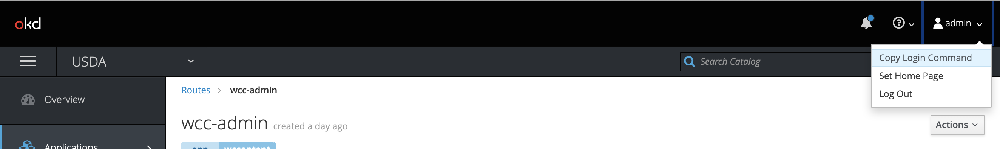

```
$ oc login https://vmdocker02.mythics.lab:8443 --token=am8BpXVkgS8h0WycY09teFxmIQJgfKG2zmlUQo534GI

$ oc secret new-dockercfg \
    --docker-server=privateregistry.example.com \
    --docker-username=developer@example.com \
    --docker-password=******** \
    --docker-email=unused \
    private-registry
```

secret/private-registry
or from GUI


Once the oracle container registy is linked successfully import the database and instantclient images using the following:


`$ oc import image container-registry.oracle.com/database/enterprise:12.2.0.1 --confirm`

`$ oc import-image container-registry.oracle.com/database/instantclient:12.2.0.1 --confirm`

 next step is to create the Database server image and test the connectivity as follows.

### Create the Database Deployment in Openshift


Provide a name for the deployemnt and then follow the next screen.

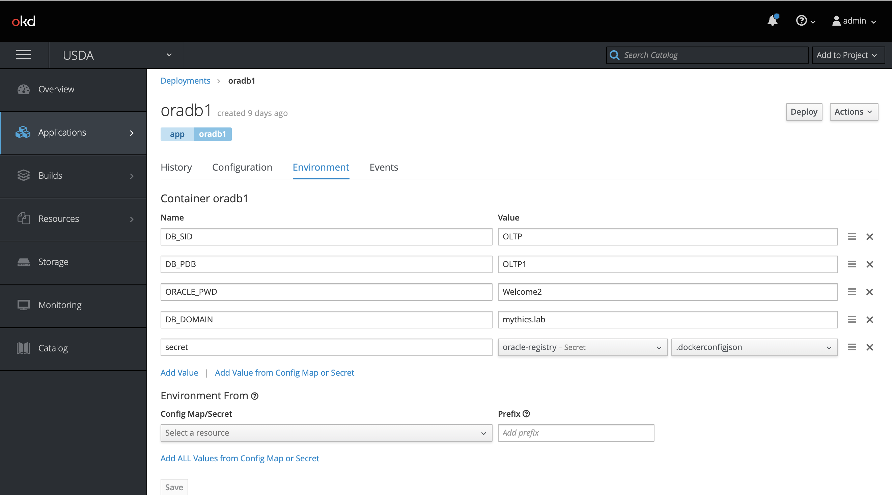

Once all the environment variables are entered save it and click deploy.
Next navigate to pods screen 


After about 10-15 minutes the database service should be up and running. You can track the progress of the install in the pods logs tab

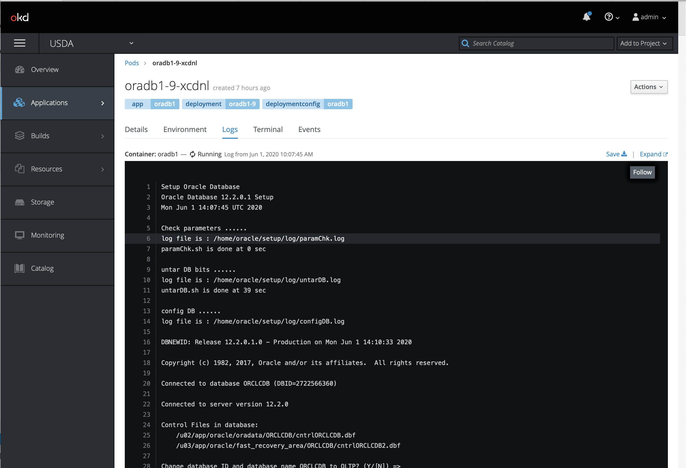


### Test the Database Service and Connectivity

Oracle provides a thin instantclient docker image to use sqlplus command from a container. This is useful in debugging and testing the database connectivity between pods.
Using a similar procedure to database import the instantclient image.
Run this image in a termianl and connect to the database to test the connectivity.

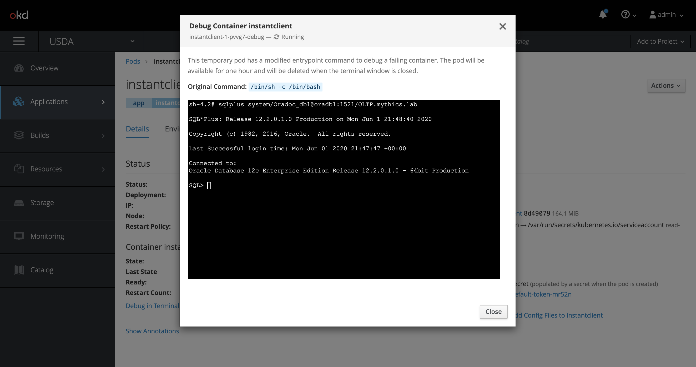


This step validates the database is running correctly in Openshift so that we can proceed to the next step of setting up Java container and installing the Webcenter content server.

### Building Webcenter Docker Image

Webcenter Docker Image Needs to be built on a Linux Machine as described in the next section.
#### Clone this Repository

1. Navigate to a local directory where you want to clone this repository
2. Run this command in a terminal: `git clone git@github.com:praveenmogili/wcc-on-openshift.git`

Alternatively, you can download the entire repository as a zip file by [clicking here](https://github.com/praveenmogili/wcc-on-openshift/archive/master.zip).

#### Download the wcc binary zip file
1. Download the binary zip from [here](https://www.oracle.com/middleware/technologies/webcenter-content-download.html) and place in this location: `[CLONED_REPOSITORY_DIRECTORY]/wcc/fmw_12.2.1.4.0_wccontent_Disk1_1of1.zip`

#### Build the wcc docker image
1. Navigate to  `wcc/` folder in your local cloned repository directory
2. Run this command in a terminal: `docker build .`
3. You should eventually(~ 15-20 minutes later) see a message indicating success:

#### Push the wcc docker image to openshift

There are a couple of ways to achieve this:
1. Upload the image to a public docker registry like quay.io or docker.github.com and then link your credentials to openshift secret 
2. Directly from the local machine or local private(insecure) docker registry. Below is an example of this:
   
```
$ oc import-image --insecure <image_stream_name>[:<tag>] --from=<docker_image_repo> --confirm

--insecure switch is needed if it is running on a self-signed private registry
```

Once this is done successfully, you should be able to see this in openshift as follows:
```
% oc get is  
NAME                 DOCKER REPO                               TAGS                                                   UPDATED
docker               172.30.1.1:5000/usda/docker               latest                                                 3 days ago
enterprise           172.30.1.1:5000/usda/enterprise           12.2.0.1                                               9 days ago
fmw-infrastructure   172.30.1.1:5000/usda/fmw-infrastructure   12.2.1.3-200316,12.2.1.4-200316,12.2.1.3 + 1 more...   3 days ago
instantclient        172.30.1.1:5000/usda/instantclient        latest                                                 9 days ago
oraclelinux          172.30.1.1:5000/usda/oraclelinux          7                                                      9 days ago
oradb                172.30.1.1:5000/usda/oradb                12.2.0.1-ee                                            
wccontent            172.30.1.1:5000/usda/wccontent            12.2.1.3                                               24 hours ago
```

## WCC Deployment in Openshift

### Create the wcc Deployment in Openshift

Now, its time to deploy WCC application in Openshift. Click Deploy Image as shown below and select the wccontent image stream uploaded above.

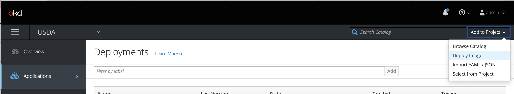

### Create the Persistent Storage and Attach it to the deployment
Add persistent storage for domain configuration data and log files.

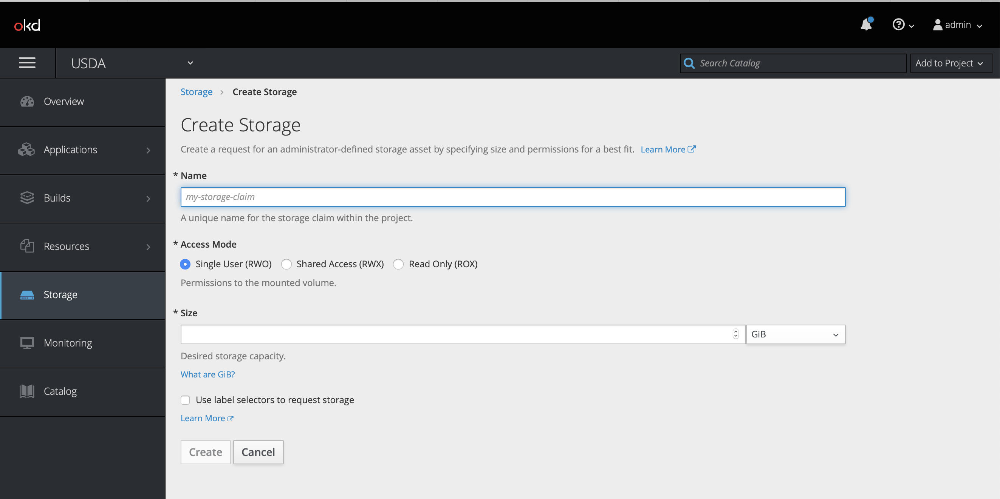
Then attach it in the deployment configuration as shown below:


### Create the Environment Variable
Based on the *wcc.env* file create the environment for WCC app

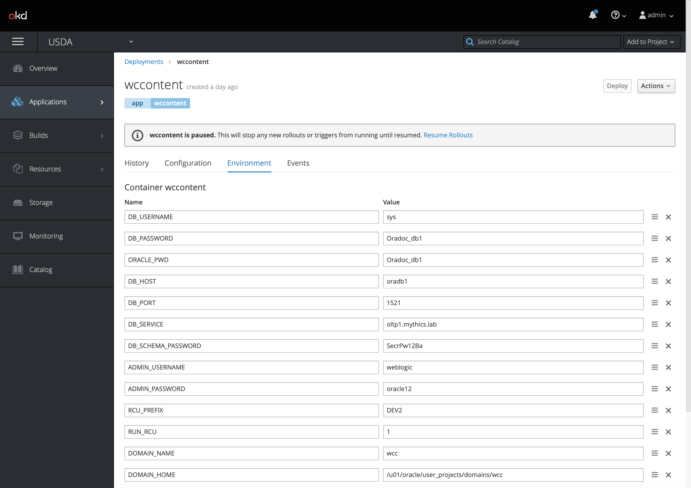

### Deploy the WCC Pod
Deploy the application and watch the logs for the pods to finish (takes anywhere from 15-20 minutes)

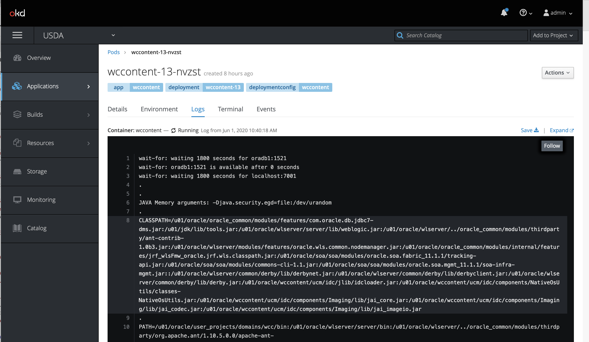

Once you see the pod running, 

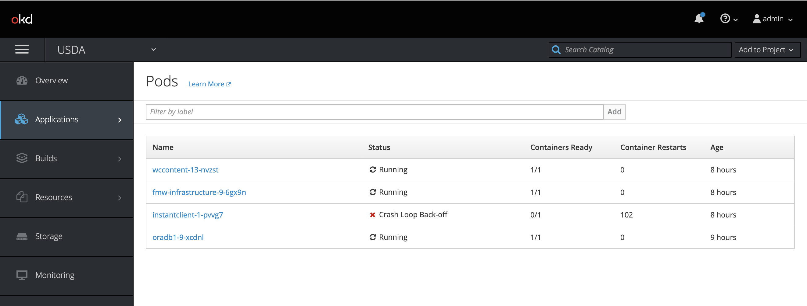
its time to create the service and routes to access the application from the browser.

### Create the WCC Services in Openshift
Create services based on the file in `wcc/wcc.yml` downloaded above using the command:
`$ oc apply -f wcc.yml`

### Create the Routes for Weblogic Admin and Webcenter Content in Openshift

Create two route for the WCC application:
1. for Weblogic admin console for the port 7001 
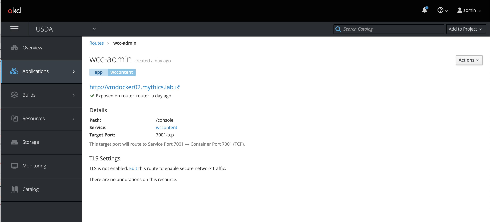
2. for WCC application for the port 16200


## Accessing the Application 
Accessing the console for first time will deploy the application and redirect you to weblogc login page. 

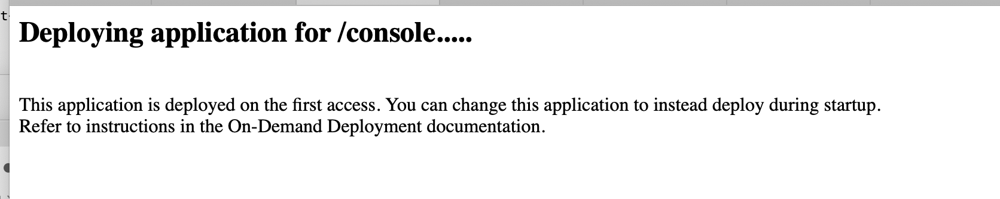
Use the credentials provided in  

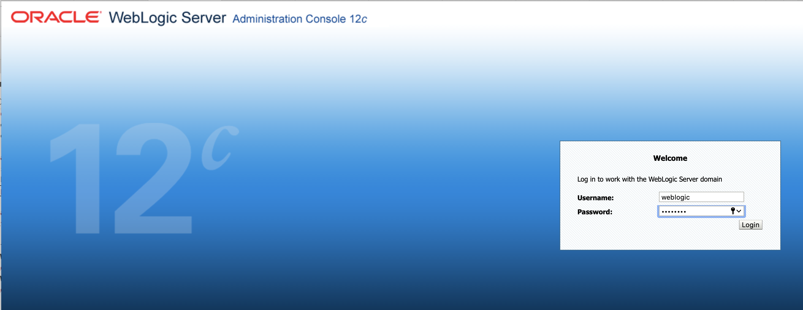
Weblogic admin portal:

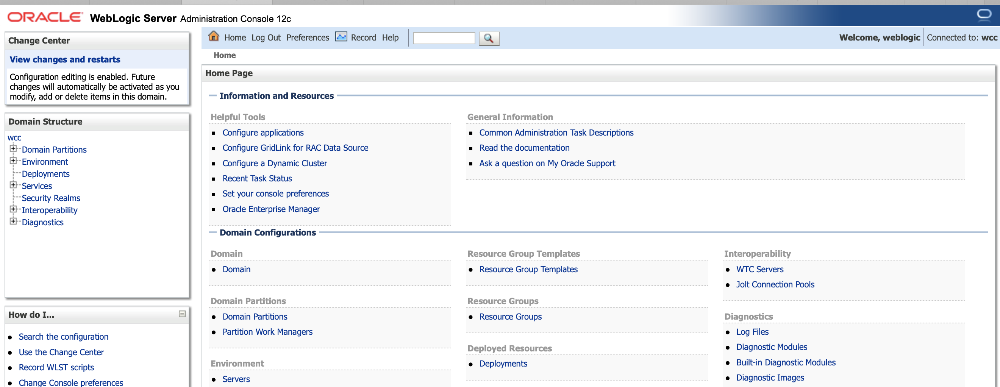
Accessing the WCC app for first will ask you to select configuration options and restart the node 


To restart the server, you can remove the pod and it will restart as the auto start/rollout is enablled in the deployment.

Once the pod is backup you will see the login screen as shown below:

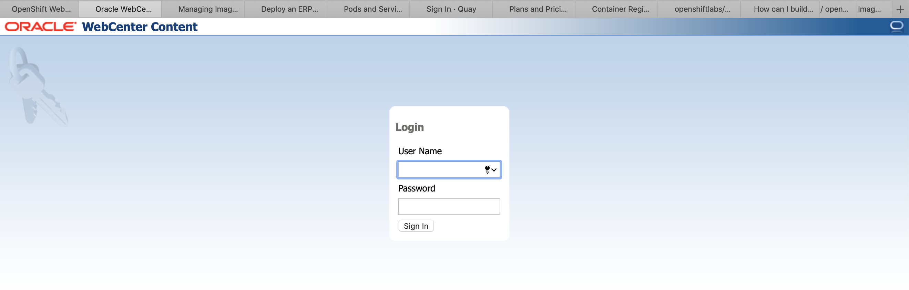
and the app dashboad:


## Summary
At a high level the following steps need to be performed for a successful WCC image deployment in Openshift platform.
Steps
1. Create Openshift secrets for Oracle Container Registry
2. Import Database and Instantclient Images from Oracle 
3. Complete Database pod setup
4. Download Webcenter Image and build a docker image on local Linux machine
5. Upload the WCC Image to Openshift
6. Deploy the WCC Application
7. Create Services and Routes for WCC application
8. Configure the Application 