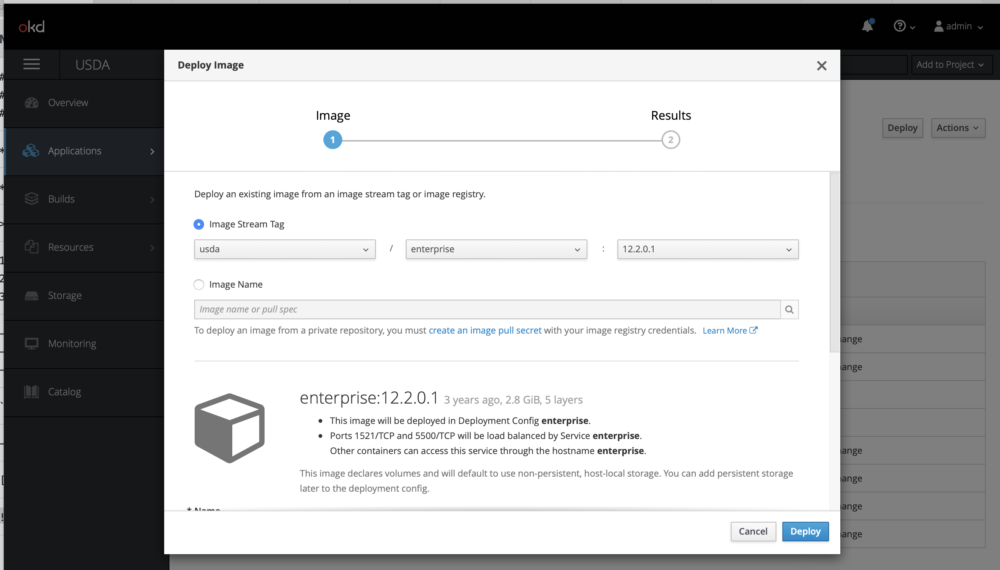
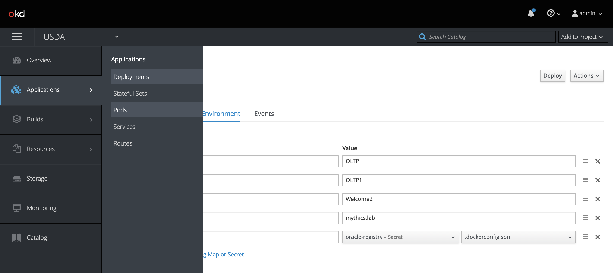

# Running Oracle Webcenter Content in Openshift

## Overview
Oracle Webcenter content server runs on top of Oracle Fusion Middleware Java container and requires a database to store the content and metadata for this purpose we need Oracle Database server.

This means we need to build two docker containers 
1. Oracle DB Container (version 12.2.0.1)
2. Oracle FMW Container (version 12.2.1.4)

## Build Docker Images

### Building Oracle Database Image 

This image can be imported directly into Openshift from Oracle Container Registry (container-registry.oracle.com/database/enterprise:12.2.0.1) [Link to Oracle](https://container-registry.oracle.com/)
First create a secret for connecting to this registry.

$ oc secret new-dockercfg \
    --docker-server=privateregistry.example.com \
    --docker-username=developer@example.com \
    --docker-password=******** \
    --docker-email=unused \
    private-registry

secret/private-registry

Webcenter Docker Image Needs to be built on a Linux Machine as described in the next section.

### Create the Database Deployment in Openshift

Provide a name for the deployemnt and then follow the next screen.

Once all the environment variables are entered save it and click deploy.
Next navigate to pods screen 

After about 10-15 minutes the database service should be up and running. You can track the progress of the install in the pods logs tab

### Test the Database Service and Connectivity

### Building Webcenter Docker Image

#### Clone this Repository

1. Navigate to a local directory where you want to clone this repository
2. Run this command in a terminal: `git clone git@github.com:praveenmogili/wcc-on-openshift.git`

Alternatively, you can download the entire repository as a zip file by [clicking here](https://github.com/praveenmogili/wcc-on-openshift/archive/master.zip).

#### Download the wcc binary zip file
1. Download the binary zip from [here](https://www.oracle.com/middleware/technologies/webcenter-content-download.html) and place in this location: `[CLONED_REPOSITORY_DIRECTORY]/images/wcc/fmw_12.2.1.4.0_wccontent_Disk1_1of1.zip`

#### Build the wcc docker image
1. Navigate to your local cloned repository directory
2. Run this command in a terminal: `docker build .`
3. You should eventually see a message indicating success:

#### Push the wcc docker image to openshift

$ oc import-image --insecure <image_stream_name>[:<tag>] --from=<docker_image_repo> --confirm
--insecure is needed if it is running on a self-signed private registry

## Create the wcc Deployment in Openshift
### Create the Environment Variable
### Create the Persistent Storage and Attach it to the deployment

## Create the WCC Services in Openshift

## Create the Routes for Weblogic Admin and Webcenter Content in Openshift

## Deploy the Application 
accessing the console for first time should deploy the application and redirect you to weblogc login page. Use the credentials provided in  
### Importing the Docker Images

**normal**